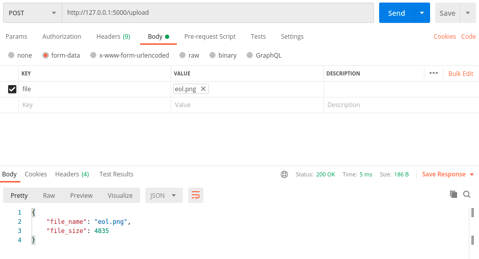
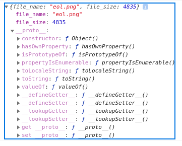

# cloud-developer-assignment

Steps:
1. Use create-react-app to setup quick frontend
   - setup socket listener
   - select file to upload
   - upload file
   - Send file to flask api
   - listen for response
   
2. Setup flask
   - use flask_socketio
   - listen for file
   - send file metadata as response
## How to run

``
python3 venv venv
source venv/bin/activate
pip install -r requirements.txt
python api.py

cd frontend/frontend
npm i
npm start
``

## Testing The API
Using Postman, set form-data with key:file and value:eol.png as test. Post to /upload

View the emit in the Chrome Console:

